## Lab Report 2 - Testing & Debugging

### What you'll need:
#### Files
* [Server.java](Server.java)
* [ArrayExamples.java](ArrayExamples.java)
* [ListExamples.java](ListExamples.java)

### Part 1: Simplest Search Engine

Create a new file (We'll call ours `SearchEngine.java`) and paste the following code:
```java
import java.io.IOException;
import java.net.URI;
import java.util.Vector;

class Handler implements URLHandler {
        // Vector of strings that will contain all the words we add
        Vector<String> stringList = new Vector<String>();
        public String handleRequest(URI url) {

            // If the URL doesn't have any arguments, load home page
            if (url.getPath().equals("/")) {
                return String.format("Ready to search!");
            } 
            else {
                System.out.println("Path: " + url.getPath());
                if (url.getPath().contains("/add")) {
                    String[] parameters = url.getQuery().split("=");

                        // Add the string we included in the argument (parameters[0] = "?s")
                        stringList.add(parameters[1]);
                        return String.format("New word added: %s", parameters[1]);
                }
                else if (url.getPath().contains("/search")) {
                    String[] parameters = url.getQuery().split("=");

                    //Create a new vector to store words that match query
                    Vector<String> results = new Vector<String>();

                        // Loop through every word in stringList and add each one to results
                        // if the word matches the query
                        for (String s : stringList){
                            // parameters[1] = query word, parameters[0] = tag "?s"
                            if (s.contains(parameters[1])){
                                results.add(s);
                            }
                        }
                    return results.toString();
                }
                return "404 Not Found!";
            }
        }
    }

    class SearchEngine {
        public static void main(String[] args) throws IOException {
            if(args.length == 0){
                System.out.println("Missing port number! Try any number between 1024 to 49151");
                return;
            }
            int port = Integer.parseInt(args[0]);
            Server.start(port, new Handler());
        }
    }
```
Save the new file in the same directory as `Server.java`, then compile and run the code with the following commands:
* `javac Server.java SearchEngine.java`
* `java SearchEngine (pick a number between 1024-49151)`

You should see the following on your terminal:
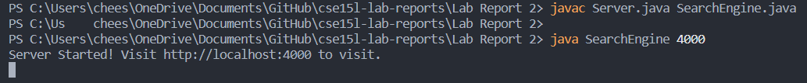

Now we have a local server running on our computer! This will run in the background on our computer until we cancel the command on the terminal by pressing `CTRL-C`.

Notice that we were given a localhost URL on the terminal. If we visit that URL on a web browser, we'll see this:
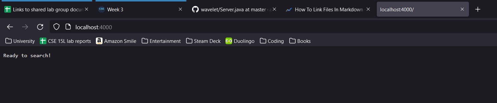

Our search engine works by adding words to a list of Strings, then searching that list for words that match our query.

First, let's add some words to our list: We can use the `/add?s=` argument at the end of the URL to add any word after the `=` to our list.

For example, we can add "tomato" to our list by inserting `/add?s=tomato` to the end of the URL:
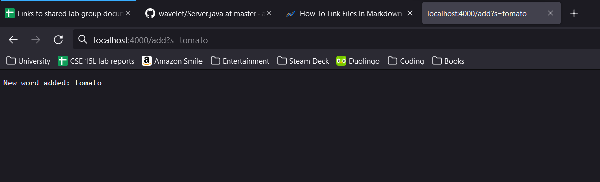


The page updates to show that "tomato" was added to our list!

Here's what's happening in the background:
* When we add the `/add?s=tomato` argument to the URL and press `enter`, we pass the new URL to the `handleRequest` method.
* Within `handleRequest`, the URL catches the if statement looking for `/add` and splits our argument in two: `s` and `tomato`.
* Then, the second argument (our new word; in this case "tomato") is added to `stringList`; the site updates to show the word was added.

Let's add a couple more words before we make our first query:
* Add "cherry"
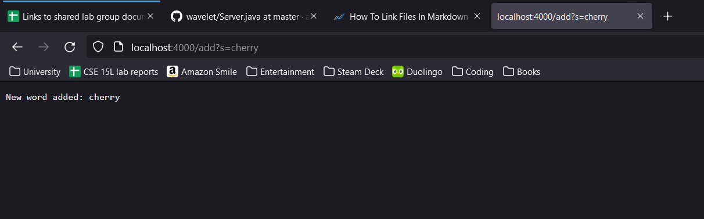

* Add "shill"
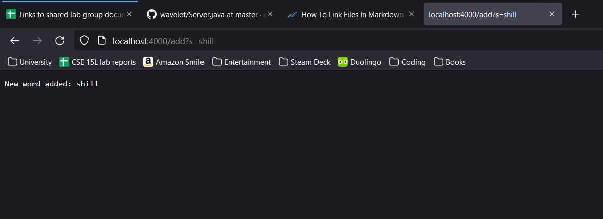

* Add "child"
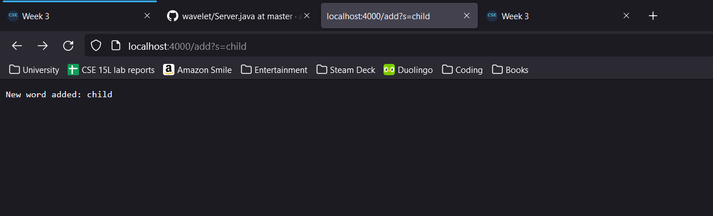

* Add "thick"
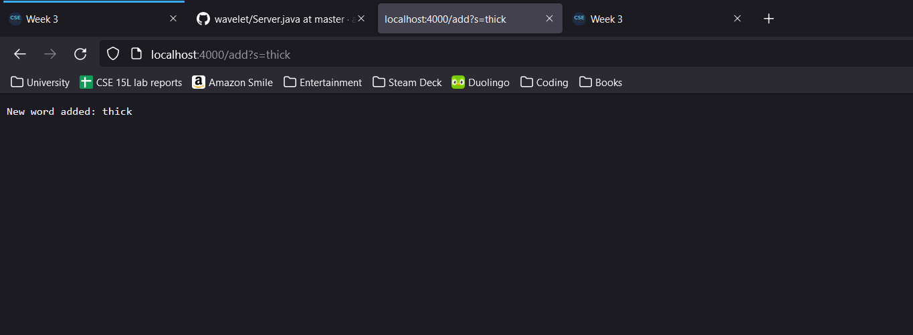

* Add "think"
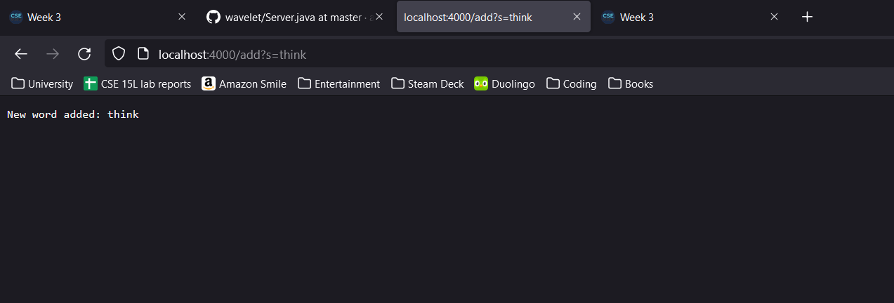


Now, let's make our first query; we want to search our word list for every word with "hi" in it. 

For that, we'll replace `/add?s=` with a new argument: `/search?s=hi`.

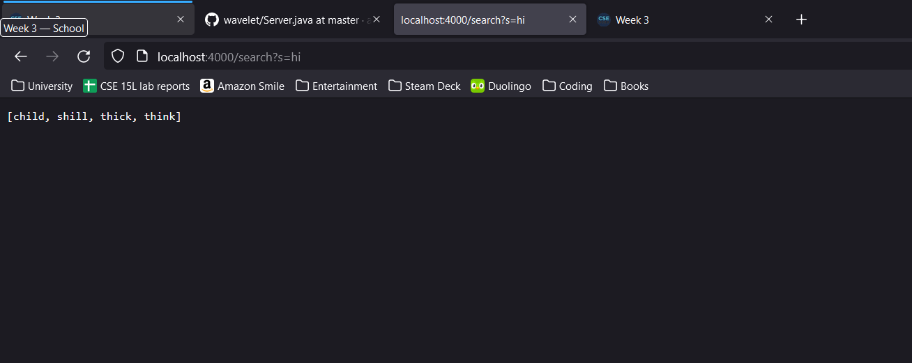

How `/search?s=hi` works is similar to how `/add` works:
* We update the URL passed to `handleRequest` method.
* We catch the if statement looking for `/search` in our new URL.
* The method then splits our argument in two: `s` and any word after `=` (e.g. `hi`).
* The method looks through every word in `stringList` for any word that contains/matches the second argument (our query word `hi`) and copies every matching word to a new list of Strings (`results`).
* Once `stringList` has been fully read through, the method returns `results` and prints it on the site.

Now we set up our simple search engine! We can add as many words as we want, and search within those words.

### Part 2: Testing and Debugging

We're going to focus on two bugs found in files `ArrayExamples.java` and `ListExamples.java`.

#### Part 2a. ArrayExamples.java
First, we'll run some tests to make sure that `ArrayExamples.java` runs as intended:

```java
import static org.junit.Assert.*;
import java.lang.reflect.Array;
import org.junit.*;

public class ArrayTests {
    @Test 
	public void testReversedLength1() {
    int[] input1 = { 3 };
    assertArrayEquals(new int[]{3}, ArrayExamples.reversed(input1));
	}

    @Test
    public void testReversedLength2(){
        int[] input1 = {3,6};
        assertArrayEquals(new int[]{6,3}, ArrayExamples.reversed(input1));
    }
}
```

After running JUnit, we get the following output on the terminal:


By reading the failure output, we can see the main symptom to a bug: the array passed into `reversed` isn't being reversed.

Let's look at `ArrayExamples` to see if we can find our bug:
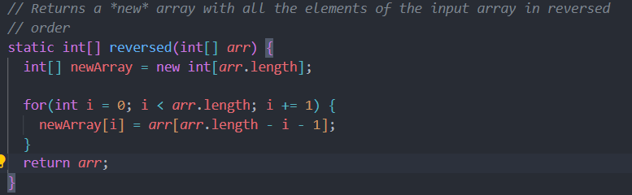

The array being returned is the input array `arr`, not the reverse array `newArray`! We can fix this by correcting the output:

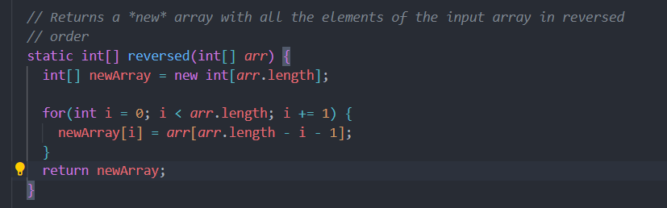

If we run our tests again with this updated code, we should see this:
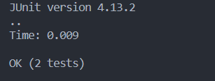

We fixed the bug! Now `reversed` should work as intended.

#### Part 2b. ListExamples

For ListExamples, let's run some tests on the `filter` method:

```java
import static org.junit.Assert.*;
import java.util.ArrayList;
import java.util.List;
import org.junit.*;

public class ListTests {
    @Test
    public void testFilter(){
        List<String> input1 = new ArrayList<String>();
        input1.add("this");
        input1.add("chair");
        input1.add("chilled");
        input1.add("ghost");
        input1.add("hills");

        List<String> input2 = new ArrayList<String>();
        input2.add("this");
        input2.add("chilled");
        input2.add("hills");
        assertEquals(input2, ListExamples.filter(input1, new StringCheck()));
    }
}
```

Let's see what we get in our terminal:


From our failuer output, it looks like we found our main symptom: the `filter` method works as expected but saves our list in reverse order.

Let's take a look at the code for `filter`:

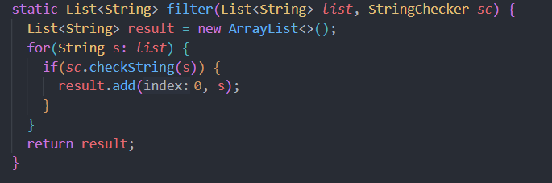

Looking at the [documentation for List methods](https://docs.oracle.com/javase/8/docs/api/java/util/List.html), our implementation of `add` means that every time we add a string, we add it to index 0 of our `result` List.

This means that every new word is added to the beginning of the list, saving them in reverse order instead in the order they appear in the original list.

By removing the 0 parameter in `add`, it should fill `result` in the proper order:
```java
static List<String> filter(List<String> list, StringChecker sc) {
    List<String> result = new ArrayList<>();
    for(String s: list) {
      if(sc.checkString(s)) {
        result.add(s);
      }
    }
    return result;
  }
```

After running our test again, we should see this:

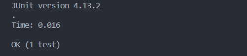

Our test passed! Now our `filter` method works as intended.
