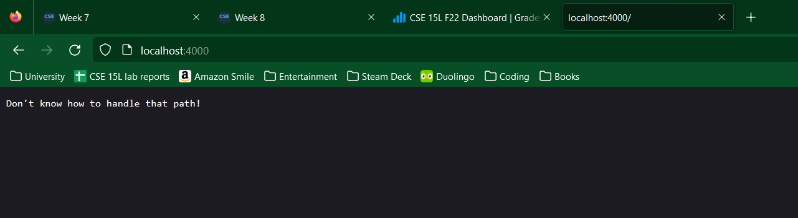

# Lab Report 5 - Grade Server

## What we'll need

* [A clone of this GitHub repository](https://github.com/adrianaispuro/list-examples-grader)

### Part 1: Running grade.sh

Once we clone the GitHub repository from above, we should see a file called "grade.sh" that contains this code:

```bash
CPATH=".;lib/junit-4.13.2.jar;lib/hamcrest-core-1.3.jar"

rm -rf student-submission
git clone $1 student-submission

echo 'Finished cloning'
cd student-submission

FILEPATH=`find ./ -name "ListExamples.java"`

if [[ $FILEPATH != "" ]]
    then
    echo "File found"
    cp $FILEPATH ../
    else
    echo "Missing file / file not found"
    echo "Failed - try again"
    exit 1
fi

cd ..

javac -cp $CPATH *.java 2> compile-err.txt

if [[ $? -ne 0 ]]

    then
    echo "Compile error(s)!"
    if [[ `grep "errors" compile-err.txt` -ge 1 ]]
        then
            echo "Failed - too many compile errors"
        else
            echo "Failed - one compile error"
    fi
    cat compile-err.txt
    exit 1

    else
    echo "Compiled successfully"
fi

java -cp $CPATH org.junit.runner.JUnitCore TestListExamples > test-results.txt 2> test-err.txt

if [[ `grep "FAILURES" < test-results.txt` -ne 0 ]]
then
    echo "Failed - Test(s) failed"
    cat test-results.txt
    exit 1
else   
    echo "Passed - all tests run successfully"
    exit 0
fi


```

This script is important as this enables us to "grade" a repository on our server.

Once we run `java GradeServer 4000`, we should see the following page:



Now, we can pass a GitHub repo URL as an argument in the localhost URL to "grade" a student's submission:

* Grading [Student Submission 1](https://github.com/ucsd-cse15l-f22/list-methods-corrected)


Here, our submission receives a passing grade as it contains the file, compiles correctly, and passes all tests.

* Grading [Student Submission 2](https://github.com/ucsd-cse15l-f22/list-methods-compile-error)


This student's submission does not receive a passing grade because their file contains a compile error.

* Grading [Student Submission 3](https://github.com/ucsd-cse15l-f22/list-methods-nested)


This submission receives a passing grade, although the file we're grading (`ListExamples.java`) is nested in a different directory.

### Part 2: Tracing the grading script

For this report, we'll observe a trace of `grade.sh` grading student submission 3.

**Line 4:** `rm -rf student-submission`

* No stdout, stderr (command deletes directory)
* Return code: 0

**Line 5:** `git clone $1 student-submission`

* No stdout, stderr
* Return code: 0

**Line 8:** ```FILEPATH=`find ./ -name "ListExamples.java"` ```

* Runs `find` command and assigns result to FILEPATH variable
* Result: `./pa1/ListExamples.java`

**Lines 11-19:** `if [[ $FILEPATH != "" ]]`

* If loop checks if `FILEPATH` is not an empty string
* Condition is true, since `FILEPATH` has a path

**Line 14:** `cp $FILEPATH ../`

* No stdout, stderr
* Return code: 0

**Lines 15-18** do not run since the if statement condition is met

**Line 23:** `javac -cp $CPATH *.java`

* No stdout, stderr
* Return code: 0

**Lines 25-40:** `if [[ $? -ne 0 ]]`

* If loop checks the return code of line 23 is not equal to zero (exit code != 0 means errors)
* Condition is false, since line 23 has return code of 0

**Lines 27-36** are not run since if statement condition is not met

**Line 42:** `java -cp $CPATH org.junit.runner.JUnitCore TestListExamples > test-results.txt`

* **_stdout:_**

```bash
JUnit version 4.13.2
..
Time: 0.007

OK (2 tests)
```

* No stderr
* Return code: 0

**Lines 44-52:**

```bash
if [[ `grep "FAILURES" < test-results.txt` -ne 0 ]]
```

* If loop checks if "FAILURES" is present in `test-results.txt`, indicating that tests failed
* Condition is false; since `test-results.txt` does not contain "FAILURES", all tests passed

**Lines 46-48** are not run since if statement condition is not met
